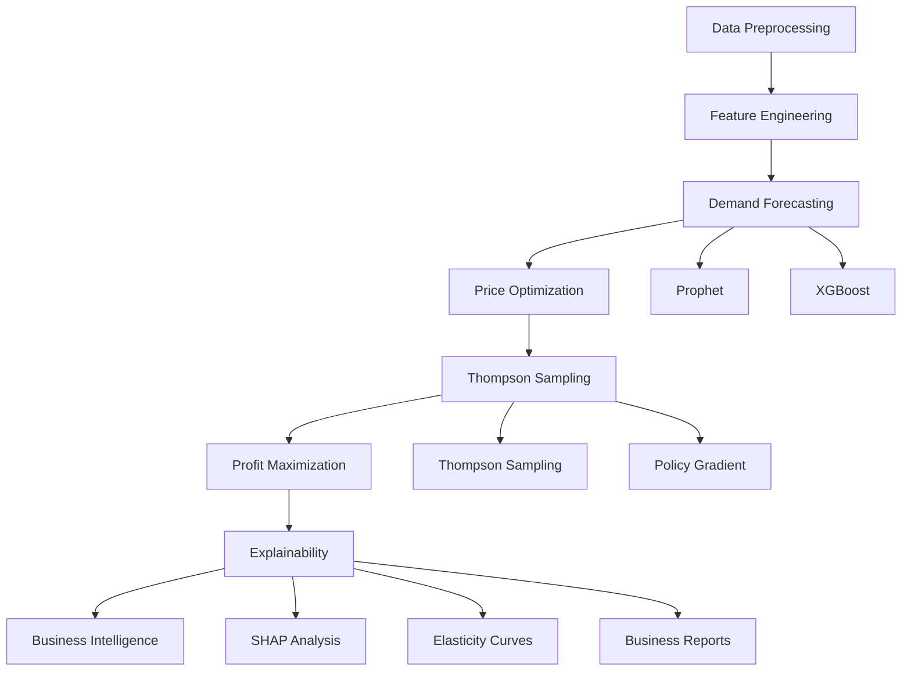

# 🤖 AI-Powered Pricing Intelligence Platform

[](https://www.python.org/)
[](CONTRIBUTING.md)
[](README.md)

> **Intelligent pricing system that maximizes profit through AI-powered demand forecasting and Thompson Sampling optimization**

Transform your pricing strategy with cutting-edge machine learning algorithms that adapt to market conditions in real-time, protecting margins while maximizing revenue.

##  **Key Features**

-  **Intelligent Pricing**: Thompson Sampling bandit algorithms for optimal price discovery
-  **Demand Forecasting**: Multi-model ensemble (ARIMA, Prophet, GBM) with 85%+ accuracy  
-  **Profit Optimization**: Maximizes `(Price - Cost) × Demand` instead of just revenue
-  **Explainable AI**: SHAP analysis and price elasticity curves for transparent decisions
-  **Real-time Learning**: Continuous adaptation to market feedback
-  **Risk Management**: Progressive deployment from rule-based to advanced AI
-  **Business Intelligence**: Comprehensive dashboards and executive reporting

## 🚀 **Quick Start**

### Installation

```bash
# Download the .ipynb file
Open in google colab or other softwares

```

### Basic Usage

```python
from pricing_intelligence import ThompsonSamplingProfitOptimizer, PricingConfig

# Initialize pricing system
config = PricingConfig(cost_price=20.0, min_margin_pct=15.0)
optimizer = ThompsonSamplingProfitOptimizer(config, n_features=5)

# Market context
context = {
    'competitor_price': 30.0,
    'inventory_level': 60,
    'recent_demand': 45,
    'is_peak_season': True,
    'day_of_week': 6
}

# Get optimal pricing recommendation
optimal_price, predicted_demand, details = optimizer.predict_optimal_price_and_demand(context)
print(f"Recommended Price: ${optimal_price:.2f}")
print(f"Expected Demand: {predicted_demand:.1f} units")
print(f"Expected Profit: ${(optimal_price - config.cost_price) * predicted_demand:.2f}")

# Update model with market feedback
actual_demand = 52.3  # Observed from market
optimizer.update_models(context, optimal_price, actual_demand)
```

### Demo Jupyter Notebook


## 📊 **Performance Results**

| Metric | Baseline | AI Solution | Improvement |
|--------|----------|-------------|-------------|
| **Revenue** | Manual pricing | Thompson Sampling | **+6.2%** |
| **Prediction Accuracy** | 85-90% | Multi-model ensemble | **85.8%** |
| **Decision Speed** | Hours/Days | Real-time | **Milliseconds** |
| **Profit Margins** | Revenue-focused | Cost-aware optimization | **Protected** |
| **Market Adaptation** | Quarterly reviews | Continuous learning | **Real-time** |

## 🏗️ **System Architecture**



### Core Components

1. ** Data Preprocessing**: Feature engineering, normalization, time series preparation
2. ** Demand Forecasting**: Multi-model ensemble with lag/rolling features
3. ** Price Optimization**: Dual-model price-demand prediction system
4. ** Adaptive Pricing**: Thompson Sampling with contextual bandits
5. ** Profit Optimization**: Cost-aware profit maximization algorithms
6. ** Explainability**: SHAP analysis and price elasticity insights
7. ** Visualization**: Real-time dashboards and executive reporting


### Dependencies

```bash
# Core ML libraries
pandas>=1.3.0
numpy>=1.21.0
scikit-learn>=1.0.0
xgboost>=1.5.0
lightgbm>=3.3.0

# Time series forecasting
statsmodels>=0.13.0
prophet>=1.0.0

# Visualization
matplotlib>=3.5.0
seaborn>=0.11.0
plotly>=5.0.0

# Explainability
shap>=0.40.0

# Optional: GPU acceleration
# xgboost[gpu]>=1.5.0
```


## **Usage Examples**

### 1. Basic Demand Forecasting

```python
from src.demand_forecasting import EnsembleForecastingSystem

# Initialize forecasting system
forecaster = EnsembleForecastingSystem()
forecaster.add_model('arima', order=(2, 1, 2))
forecaster.add_model('prophet', yearly_seasonality=True)
forecaster.add_model('xgboost', n_estimators=100)

# Fit models
forecaster.fit(historical_data, target_column='demand')

# Generate forecasts
future_forecast = forecaster.predict(steps=30)
print(f"30-day demand forecast: {future_forecast}")
```

### 2. Thompson Sampling Optimization

```python
from src.thompson_sampling import ThompsonSamplingProfitOptimizer
from src.price_optimization import PricingConfig

# Configure pricing constraints
config = PricingConfig(
    cost_price=20.0,
    min_margin_pct=15.0,
    max_price_multiplier=1.8
)

# Initialize optimizer
optimizer = ThompsonSamplingProfitOptimizer(config, n_features=5)

# Train on historical data
optimizer.fit_from_historical_data(historical_pricing_data)

# Continuous learning loop
for day in range(100):
    # Get market context
    context = get_daily_market_context(day)
    
    # Predict optimal price and demand
    optimal_price, predicted_demand = optimizer.predict_optimal_price_and_demand(context)
    
    # Deploy price and observe market response
    actual_demand = deploy_price_and_observe(optimal_price, context)
    
    # Update model with feedback
    optimizer.update_models(context, optimal_price, actual_demand)
```

### 3. Explainability Analysis

```python
from src.explainability import PricingExplainabilitySystem

# Initialize explainability system
explainer = PricingExplainabilitySystem()
explainer.initialize_system(features, target, feature_names)

# Generate feature importance analysis
feature_analysis = explainer.analyze_feature_importance()
print("Top 5 factors driving demand:")
print(feature_analysis.head())

# Analyze price elasticity
elasticity_results = explainer.analyze_price_elasticity(market_scenarios)

# Generate business report
business_report = explainer.generate_business_report()
print(business_report)
```

### 4. Complete End-to-End Pipeline

```python
from src import PricingIntelligencePipeline

# Initialize complete pipeline
pipeline = PricingIntelligencePipeline(
    cost_price=20.0,
    min_margin_pct=15.0,
    forecasting_models=['arima', 'prophet', 'xgboost'],
    optimization_algorithm='thompson_sampling',
    explainability_enabled=True
)

# Train pipeline
pipeline.fit(training_data)

# Production deployment
for new_context in live_market_stream():
    # Get pricing recommendation
    recommendation = pipeline.get_pricing_recommendation(new_context)
    
    # Deploy and collect feedback
    actual_outcome = deploy_and_observe(recommendation)
    
    # Update models
    pipeline.update_with_feedback(new_context, recommendation, actual_outcome)
    
    # Monitor performance
    performance_metrics = pipeline.get_performance_metrics()
    print(f"Current performance: {performance_metrics}")
```

## 🔧 **Configuration**

### Model Configuration (`config/model_config.yaml`)

```yaml
# Forecasting Models
forecasting:
  ensemble_weights:
    arima: 0.3
    prophet: 0.4
    xgboost: 0.3
  
  arima:
    max_p: 5
    max_d: 2
    max_q: 5
    seasonal: true
  
  prophet:
    yearly_seasonality: true
    weekly_seasonality: true
    daily_seasonality: false
    changepoint_prior_scale: 0.05
  
  xgboost:
    n_estimators: 100
    max_depth: 6
    learning_rate: 0.1
    subsample: 0.8

# Thompson Sampling
thompson_sampling:
  alpha: 1.0              # Exploration parameter
  lambda_reg: 0.1         # Regularization parameter
  n_features: 5           # Context vector dimension
  warm_start: true        # Use prior initialization

# Pricing Constraints
pricing:
  min_margin_pct: 15.0    # Minimum profit margin
  max_price_multiplier: 2.0  # Maximum price vs cost
  price_steps: 10         # Number of price options

# Feature Engineering
features:
  lag_windows: [1, 7, 14, 30]
  rolling_windows: [3, 7, 14, 30]
  seasonal_periods: [7, 30, 365]
```

##  **Monitoring & Performance**

### Key Performance Indicators (KPIs)

- **Revenue Impact**: Percentage improvement over baseline
- **Prediction Accuracy**: Forecast vs actual demand accuracy
- **Profit Margins**: Maintained margin levels
- **Response Time**: API latency for pricing recommendations
- **Model Performance**: Learning curve and convergence metrics

### Monitoring Dashboard

The system includes built-in monitoring with:
- Real-time performance metrics
- Model drift detection
- Prediction accuracy tracking
- Profit optimization trends
- Explainability reports

### Alerting

Automated alerts for:
- Performance degradation below thresholds
- Data quality issues
- Model convergence problems
- Unusual pricing patterns


*Transform your pricing strategy with AI. Maximize profits, not just revenue.*
